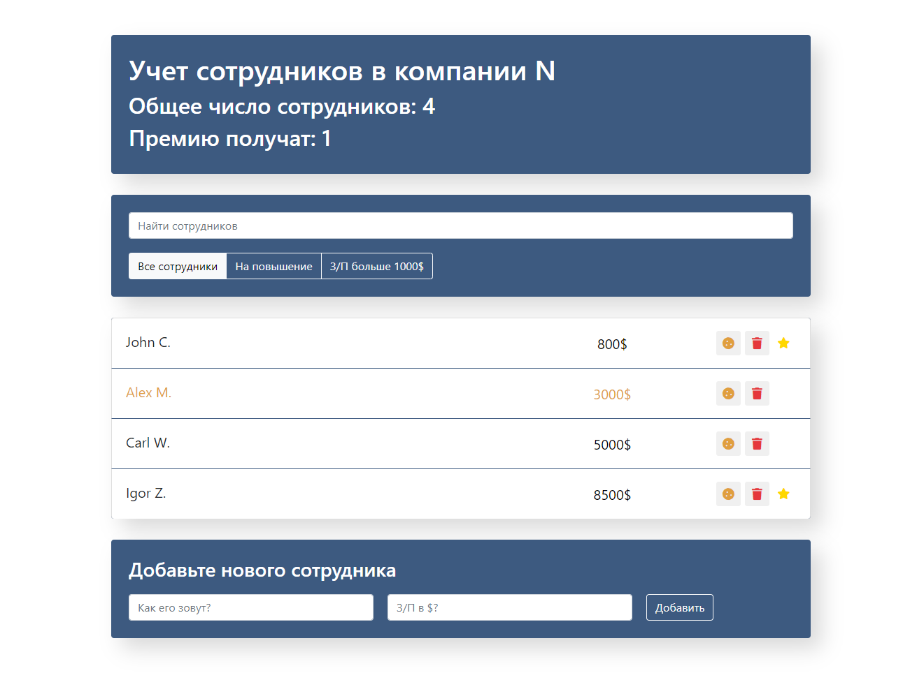

(P - project) REACT. List of employees in the company.   
Created - the total number, number of promotions, their salary, adding bonuses to employees, candidates for promotion, adding new employees. 
Used - React JS

